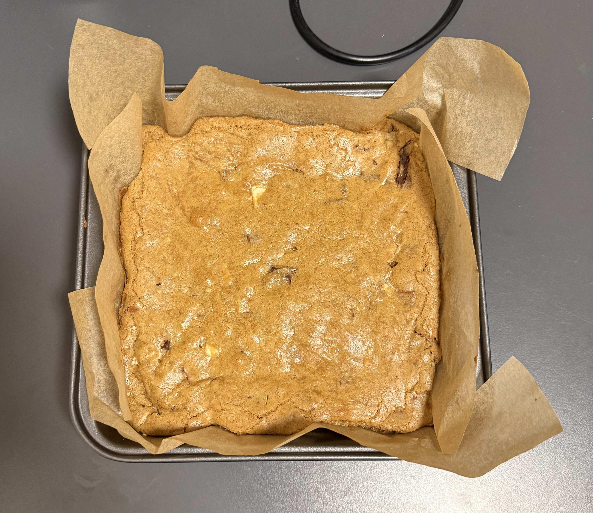

# Blondie Recipe Generator

## Overview
A data-driven blondie recipe generator built by analysing 30 recipes scraped from the web. Instead of manually reading through recipes and making subjective choices, this project uses statistical analysis to derive ingredient ratios and generate a scaled recipe from a single input: flour, butter, or sugar.

## Background
I started baking a month ago to break a limiting belief of mine. After making my mom's brownie recipe and falling in love with the process, I wanted to experiment with blondies. Rather than picking one recipe arbitrarily, I thought: why not collect many recipes, analyse them, and let the data guide the decisions?

## How It Works

### 1. Data Collection & Parsing
A website parser scans recipe pages for structured ingredient data (JSON-LD format) and loads them into a pandas DataFrame. Of 35 URLs collected, 31 were successfully parsed (89%). The 4 failures were due to non-standard JSON-LD structures on those specific sites, a known limitation of schema-based scraping. Given that 31 recipes was sufficient for robust statistical analysis, further debugging was intentionally deprioritised in favour of building a working pipeline. Results may also vary slightly between runs due to network conditions.

### 2. Data Cleaning
This was the hardest part. Challenges included:
- Normalising mixed fractions (e.g. `1 ½` to `1.5`)
- Converting all units to grams (oz, fl oz, sticks, tbsp, tsp, cups)
- Standardising leavening agents (see below)

### 3. Ratio Analysis
All ingredients were expressed as ratios relative to flour. Median was chosen over mean throughout, as outliers were skewing the mean significantly in most cases.

One key insight: you can't simply chain medians. Because `median(a/b)` and `median(b/c)` don't share the same `b`, chaining them doesn't preserve consistency. The fix was to anchor everything to flour as the single base unit.

Of the 31 scraped recipes, 30 were used for ratio analysis. One recipe was excluded as it used vegetable oil instead of butter. Since oil and butter behave differently in baking and are not interchangeable in ratio modelling, including it would have skewed the results.

### 4. Ingredient Decisions

**Butter & Sugar** — The three primary inputs (flour, butter, sugar) were chosen because they drive structure (flour), fudginess (butter/fat), and flavour and colour (brown sugar adds caramel depth and a slight brownish tinge).

**Sugar** The median brown/total sugar ratio across 30 recipes was 1.0, meaning the majority of blondie recipes use all brown sugar. The mean was 0.877 (approximately 7/8 brown), with white sugar only appearing past the 75th percentile, that is, only in recipes with relatively large total sugar amounts. This suggests bakers intentionally introduce white sugar at higher quantities to dial back the molasses intensity and prevent the blondie from becoming overwhelmingly caramel-forward. White sugar also contributes to a crackly top by caramelising at the surface during baking.

Given that the median is 1.0, the model defaults to all brown sugar. A small amount of white sugar (roughly 1/8 of total) can optionally be substituted for flavour balance and a crackly top. This is surfaced as a suggestion in the output rather than baked into the model.

**Eggs** Kept as whole egg counts rather than grams, since real recipes use 1 or 2 eggs. Egg yolks were considered for modelling but added complexity, so they became an optional suggestion in the output instead.

**Baking Powder vs Baking Soda** Some recipes used baking soda, some used baking powder. Baking soda requires an acidic component to activate (brown sugar qualifies, but not always reliably). For modelling simplicity and wider applicability, everything was standardised to baking powder. Amounts were converted from tsp/tbsp to grams for ratio analysis, then converted back to tsp for the output. 25 of 30 recipes used a baking powder or baking soda measurement that could be standardised.

**Vanilla** Compared against flour weight across the 29 recipes used for ratio analysis, and converted back to tsp/tbsp for the output.

**Cornstarch** Only 3 of 30 recipes used it, too small a sample for a reliable ratio. However, from personal experience with cookies, cornstarch adds chewiness and tenderness. Since blondies are essentially a thicker, more runny cookie dough, it is included as an optional suggestion rather than a core ingredient.

**Add-ins** Chocolate chips, nuts, and other mix-ins were catalogued but excluded from structural modelling since they don't significantly affect the blondie's base texture. A general guideline of 100-200g is suggested in the output.

## The Generator

Input any one of: flour (g), butter (g), or sugar (g)

```python
blondie_ingredient_calculator(butter=150)
```

```
{
  'flour_g': 160.0,
 'baking_powder': '3/4 tsp',
 'butter_g': 150.0,
 'brown_sugar_g': 245.6,
 'eggs': 1,
 'vanilla_extract': '1 tsp',
 'add-ins': '100–200g recommended (baking chocolate, chocolate chips, nuts, etc.)',
 'optional': 'add 2 tsp cornstarch for extra tenderness, +1 egg yolk for fudgier texture, or replace some brown sugar with white for a crackly top.'


}
```

## Validation
The generator was tested against a [published blondie recipe](https://www.youtube.com/shorts/R8UGYcHOZM8) from [Benjamin Delwiche (@benjaminthebaker)](https://www.youtube.com/@benjaminthebaker), a baking content creator and cookbook author known for his science-driven approach to baking. The recipe uses 284g butter for a 13x9 pan.

| Ingredient | Published Recipe | Generator Output |
|---|---|---|
| Eggs | 3 | 3 ✅ |
| Vanilla | 1 tbsp | 1 tbsp ✅ |
| Flour | 315g | 302.9g (~4% off) |
| Total Sugar | 450g | 465g (~3% off) |
| Baking Powder | 1 tsp | 1.25 tsp |

Eggs and vanilla matched exactly. Flour and sugar were within normal recipe variation.

## The Bake
Scaled to an 8x8 pan from a 13x9 reference using surface area ratio (0.55 x 284g gives approximately 150g butter).



## What I Learned
- Median is more robust than mean when outlier recipes skew the data
- Ratio chaining with medians breaks: always anchor to one base variable
- Domain knowledge is essential for validating statistical outputs, not just the numbers alone
- Knowing the limits of your data matters as much as knowing how to analyse it
- Sometimes a working pipeline at 86% coverage beats a perfect one at 0%
- Data can reveal why patterns exist, not just that they exist. The white sugar finding was as much a culinary insight as a statistical one
